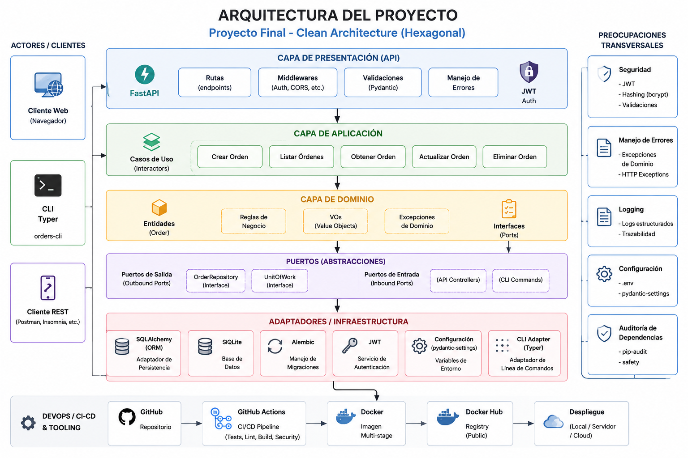

# Proyecto Final Integrador — Orders Service

## Descripción

`proyecto_final` es un servicio backend desarrollado en Python utilizando FastAPI y arquitectura Hexagonal/Limpia.

El proyecto implementa un sistema de gestión de órdenes con:

- dominio desacoplado,
- casos de uso,
- puertos y adaptadores,
- autenticación JWT,
- CLI operativa,
- pruebas automatizadas,
- Docker multistage,
- CI/CD,
- auditoría de dependencias,
- configuración segura,
- migraciones Alembic.

---

# Objetivos del proyecto

- Construir un servicio desacoplado basado en Clean Architecture.
- Implementar dominio y casos de uso aislados.
- Exponer una API segura con FastAPI.
- Aplicar buenas prácticas de calidad y mantenimiento.
- Automatizar validaciones y despliegues mediante CI/CD.
- Contenerizar la aplicación utilizando Docker.
- Gestionar configuración y seguridad correctamente.

---

# Arquitectura

El proyecto sigue una estructura basada en Arquitectura Hexagonal/Limpia.

```text
src/proyecto_final/
│
├── domain/            # Entidades y lógica de dominio
├── application/       # Casos de uso y puertos
├── infrastructure/    # Persistencia y adaptadores
├── api/               # FastAPI routers y schemas
├── cli/               # CLI Typer
├── core/              # Configuración y seguridad
└── scripts/           # Scripts auxiliares
```

---

# Tecnologías utilizadas

## Backend

- Python 3.14
- FastAPI
- SQLAlchemy
- SQLite
- JWT Authentication

---

## Calidad

- pytest
- mypy
- Ruff
- Black
- isort
- pre-commit
- Hypothesis

---

## DevOps

- Docker
- GitHub Actions
- Poetry
- Docker Hub

---

## Seguridad

- pydantic-settings
- pip-audit
- safety

---

# Características principales

## API REST

El proyecto expone endpoints FastAPI para:

- autenticación,
- creación de órdenes,
- listado de órdenes,
- eliminación de órdenes.

---

## Seguridad JWT

La API utiliza autenticación JWT mediante Bearer Tokens.

---

## Pricing Strategies

El dominio implementa distintas estrategias de pricing:

- Regular
- VIP
- Employee
- Black Friday

---

## CLI Operativa

Se implementó una CLI utilizando Typer:

```bash
poetry run orders-cli --help
```

Comandos disponibles:

- login
- list-orders
- create-order
- delete-order

---

# Configuración del proyecto

## Variables de entorno

El proyecto utiliza configuración centralizada mediante `pydantic-settings`.

Crear un archivo `.env` en la raíz:

```env
JWT_SECRET_KEY=change-me
DATABASE_URL=sqlite+aiosqlite:///./data/orders.db
```

---

# Instalación

## Clonar repositorio

```bash
git clone <repository-url>
```

---

## Instalar dependencias

```bash
poetry install
```

---

# Migraciones Alembic

## Aplicar migraciones

```bash
poetry run alembic upgrade head
```

---

## Crear nueva migración

```bash
poetry run alembic revision --autogenerate -m "migration message"
```

---

# Ejecutar aplicación

## Desarrollo

```bash
poetry run uvicorn src.proyecto_final.api.main:app --reload
```

---

## Swagger UI

```text
http://localhost:8000/docs
```

---

# Testing

## Ejecutar tests

```bash
poetry run pytest
```

---

## Ejecutar coverage

```bash
poetry run pytest --cov
```

---

# Calidad de código

## Ruff

```bash
poetry run ruff check .
```

---

## mypy

```bash
poetry run mypy src
```

---

## Black

```bash
poetry run black .
```

---

## isort

```bash
poetry run isort .
```

---

# Auditoría de dependencias

## pip-audit

```bash
poetry run pip-audit
```

---

## safety

```bash
poetry run safety scan
```

---

# Docker

## Build imagen

```bash
docker build -t proyecto_final .
```

---

## Ejecutar contenedor

```bash
docker run -p 8000:8000 proyecto_final
```

---

# Docker Hub

La imagen Docker es publicada automáticamente mediante GitHub Actions.

```text
albertohc02/proyecto_final:latest
```

---

# CI/CD

El proyecto implementa un pipeline CI utilizando GitHub Actions.

El workflow ejecuta automáticamente:

1. Lint
2. Type-check
3. Tests
4. Build wheel
5. Build Docker
6. Push Docker Hub

---

# Seguridad implementada

## Configuración segura

- Variables de entorno
- pydantic-settings
- Secrets desacoplados

---

## Runtime seguro

- Docker sin root
- Permisos mínimos
- Runtime hardened

---

## Auditoría dependencias

- pip-audit
- safety

---

# Tipos de pruebas implementadas

## Unit tests

Validación de dominio y lógica de negocio.

---

## Contract tests

Validación de contratos de repositorios.

---

## Integration tests

Validación de integración DB/API.

---

## Property-based testing

Implementado utilizando Hypothesis.

---

# Flujo general

```text
Client / CLI
      ↓
FastAPI API
      ↓
Application Layer
      ↓
Domain
      ↓
Repository Ports
      ↓
Infrastructure Adapters
      ↓
Database
```

---

# Comandos útiles

## Ejecutar API

```bash
poetry run uvicorn src.proyecto_final.api.main:app --reload
```

---

## Ejecutar CLI

```bash
poetry run orders-cli --help
```

---

## Ejecutar migraciones

```bash
poetry run alembic upgrade head
```

---

## Ejecutar tests

```bash
poetry run pytest
```

---

# Estado del proyecto

## Implementado

- Arquitectura Hexagonal/Limpia
- JWT Authentication
- FastAPI
- SQLAlchemy
- CLI Typer
- Docker multistage
- CI/CD
- Auditoría dependencias
- Alembic
- Seguridad runtime
- Type-checking
- Testing automatizado

---

# Conclusión

El proyecto representa una implementación backend moderna basada en principios de Clean Architecture y buenas prácticas de desarrollo profesional.

Integra:

- separación de responsabilidades,
- seguridad,
- automatización,
- testing,
- contenerización,
- CI/CD,
- auditoría de dependencias,
- configuración desacoplada.

El resultado final es un servicio mantenible, escalable y alineado con prácticas utilizadas en entornos profesionales modernos.

# Arquitectura



# Uso de la API y CLI

---

# Uso de la API

## Base URL

### Desarrollo local

```text
http://127.0.0.1:8000
```

---

### Api publicada

```text
https://proyecto-final.albertohernandez.dev/docs
```

---

# Autenticación

La API utiliza autenticación JWT mediante Bearer Token.

Primero es necesario iniciar sesión para obtener un token.

---

## Login

### Endpoint

```http
POST /auth/login
```

---

## Request

```json
{
  "username": "admin",
  "password": "admin123"
}
```

---

## Response

```json
{
  "access_token": "jwt-token",
  "token_type": "bearer"
}
```

---

# Uso desde Swagger UI (Web)

## Abrir Swagger

```text
http://127.0.0.1:8000/docs
```

---

## Pasos para autenticarse

1. Abrir `/docs`
2. Ejecutar `POST /auth/login`
3. Copiar el `access_token`
4. Presionar el botón `Authorize`
5. Pegar el token utilizando el formato:

```text
Bearer <token>
```

Ejemplo:

```text
Bearer eyJhbGciOi...
```

---

# Crear órdenes

## Endpoint

```http
POST /orders
```

---

## Headers

```http
Authorization: Bearer <token>
```

---

## Request

```json
{
  "customer_name": "Alberto Hernandez",
  "items": [
    {
      "product_name": "Laptop",
      "quantity": 1,
      "price": 25000
    },
    {
      "product_name": "Mouse",
      "quantity": 2,
      "price": 500
    }
  ]
}
```

---

## Response esperada

```json
{
  "id": 1,
  "customer_name": "Alberto Hernandez",
  "total": 26000,
  "items": [
    {
      "product_name": "Laptop",
      "quantity": 1,
      "price": 25000
    },
    {
      "product_name": "Mouse",
      "quantity": 2,
      "price": 500
    }
  ]
}
```

---

# Listar órdenes

## Endpoint

```http
GET /orders/{strategy}
```

---

## Strategies disponibles

* regular
* vip
* employee
* black_friday

---

## Ejemplo

```http
GET /orders/regular
```

---

## Headers

```http
Authorization: Bearer <token>
```

---

# Consultar orden por ID

## Endpoint

```http
GET /orders/{order_id}/{strategy}
```

---

## Ejemplo

```http
GET /orders/1/regular
```

---

## Headers

```http
Authorization: Bearer <token>
```

---

# Eliminar orden

## Endpoint

```http
DELETE /orders/{order_id}
```

---

## Ejemplo

```http
DELETE /orders/1
```

---

## Headers

```http
Authorization: Bearer <token>
```

---

# Uso desde consola (cURL)

## Login

```bash
curl -X POST http://127.0.0.1:8000/auth/login \
-H "Content-Type: application/json" \
-d '{
  "username": "admin",
  "password": "admin123"
}'
```

---

## Crear orden

```bash
curl -X POST http://127.0.0.1:8000/orders \
-H "Authorization: Bearer <token>" \
-H "Content-Type: application/json" \
-d '{
  "customer_name": "Alberto Hernandez",
  "items": [
    {
      "product_name": "Laptop",
      "quantity": 1,
      "price": 25000
    }
  ]
}'
```

---

## Obtener órdenes

```bash
curl -X GET http://127.0.0.1:8000/orders/regular \
-H "Authorization: Bearer <token>"
```

---

## Obtener orden por ID

```bash
curl -X GET http://127.0.0.1:8000/orders/1/regular \
-H "Authorization: Bearer <token>"
```

---

## Eliminar orden

```bash
curl -X DELETE http://127.0.0.1:8000/orders/1 \
-H "Authorization: Bearer <token>"
```

---

# Uso de la CLI

La aplicación incluye una CLI desarrollada con Typer.

---

## Ver ayuda

```bash
poetry run orders-cli --help
```

---

# Login desde CLI

```bash
poetry run orders-cli login admin admin123
```

---

# Crear orden desde CLI

```bash
poetry run orders-cli create-order "Alberto Hernandez"
```

---

# Listar órdenes desde CLI

```bash
poetry run orders-cli list-orders
```

---

# Listar órdenes con strategy específica

```bash
poetry run orders-cli list-orders --strategy vip
```

---

# Eliminar orden desde CLI

```bash
poetry run orders-cli delete-order 1
```

---

# Endpoint de salud

## Health Check

```http
GET /health
```

---

## Response

```json
{
  "status": "A la orden para el desorden"
}
```

---

# Flujo recomendado de uso

## Desde Swagger

1. Ejecutar login
2. Copiar token
3. Autorizar en Swagger
4. Crear órdenes
5. Consultar órdenes
6. Eliminar órdenes

---

## Desde consola

1. Obtener token JWT
2. Utilizar Bearer Token en requests
3. Consumir endpoints mediante curl

---

## Desde CLI

1. Ejecutar login
2. El token se almacena automáticamente
3. Consumir comandos autenticados

---

# Notas importantes

* Todas las rutas de órdenes requieren autenticación JWT.
* El token JWT expira según la configuración del proyecto.
* Swagger UI permite probar toda la API directamente desde el navegador.
* La CLI utiliza internamente la API REST.
* La variable `API_URL` puede configurarse mediante `.env` para apuntar a otro entorno.
