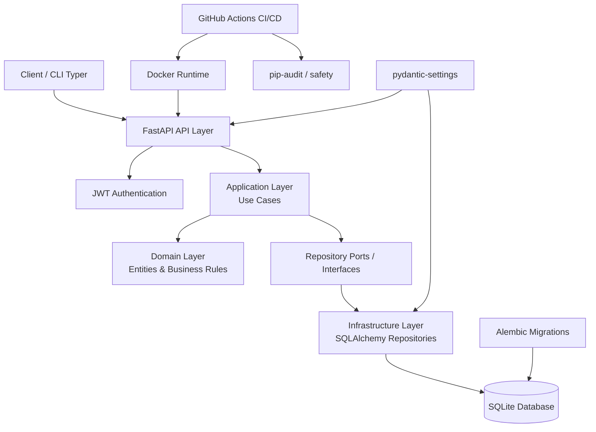

# Arquitectura — Proyecto Final Integrador

## Arquitectura General

El proyecto sigue una aproximación basada en Arquitectura Hexagonal / Clean Architecture.

---

# Diagrama de Arquitectura



---

# Explicación por capas

## Client / CLI

La aplicación puede consumirse mediante:

- clientes HTTP,
- Swagger UI,
- CLI Typer.

La CLI consume la API real utilizando JWT.

---

# API Layer

La capa API está implementada con FastAPI.

Responsabilidades:

- exposición de endpoints,
- validación de requests,
- autenticación,
- serialización,
- manejo HTTP.

---

# JWT Authentication

La autenticación utiliza:

- Bearer Tokens,
- JWT,
- dependencias FastAPI protegidas.

Esto asegura acceso controlado a endpoints sensibles.

---

# Application Layer

La capa de aplicación contiene:

- casos de uso,
- coordinación de operaciones,
- orquestación del dominio.

No contiene detalles de infraestructura.

---

# Domain Layer

El dominio contiene:

- entidades,
- reglas de negocio,
- estrategias de pricing.

Es la capa más desacoplada del sistema.

---

# Repository Ports

Los puertos definen contratos abstractos para acceso a persistencia.

Esto desacopla:

- dominio,
- aplicación,
- infraestructura.

---

# Infrastructure Layer

Implementa:

- SQLAlchemy repositories,
- modelos ORM,
- persistencia,
- acceso DB.

Es la capa concreta del sistema.

---

# Database

El proyecto utiliza SQLite mediante SQLAlchemy.

Las tablas son gestionadas mediante Alembic.

---

# Alembic

Alembic administra:

- migraciones,
- versionado schema,
- upgrades DB.

Evita uso de `create_all()` en runtime productivo.

---

# Configuración

La configuración centralizada utiliza:

- pydantic-settings,
- variables de entorno,
- `.env`.

---

# Seguridad

El proyecto implementa:

- JWT Authentication,
- Docker no-root,
- permisos mínimos,
- auditoría de dependencias.

---

# Auditoría de dependencias

Se utilizan:

- pip-audit,
- safety.

Para detección de vulnerabilidades conocidas.

---

# Docker

La aplicación utiliza Docker multistage:

- builder stage,
- runtime hardened,
- usuario no-root.

---

# CI/CD

GitHub Actions automatiza:

- lint,
- type-check,
- tests,
- build Docker,
- push Docker Hub.

---

# Flujo de ejecución

```text
Client
  ↓
FastAPI
  ↓
Application Layer
  ↓
Domain Rules
  ↓
Repository Interfaces
  ↓
SQLAlchemy Adapters
  ↓
SQLite Database
```

---

# Principios aplicados

El proyecto aplica:

- separación de responsabilidades,
- inversión de dependencias,
- desacoplamiento de infraestructura,
- configuración externa,
- automatización CI/CD,
- seguridad runtime,
- testing automatizado.

---

# Beneficios de la arquitectura

## Mantenibilidad

Las capas desacopladas facilitan evolución del sistema.

---

## Testabilidad

La separación de puertos y adaptadores permite pruebas aisladas.

---

## Escalabilidad

Es posible reemplazar infraestructura sin afectar dominio.

---

## Seguridad

La aplicación incorpora configuración segura y runtime hardened.

---

## Automatización

CI/CD y Docker permiten despliegues reproducibles.
